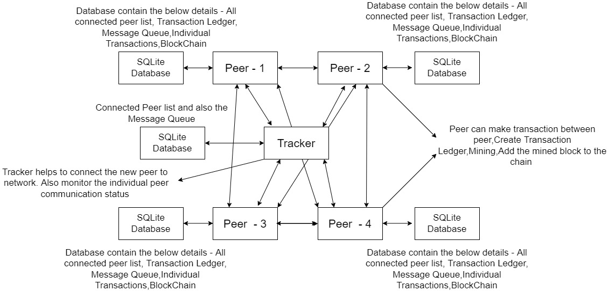

# Cheese Coin System (Block-Chain)

The goal of the project is to implement a blockchain -  peer-to-peer system inspired by Bitcoin.It uses a tracker  which help to add peers to the network and also, 
the Peer-to-Peer communication to share the data between the nodes in the cheese chain(Block-Chain)

# Architecture of the System

# Procedure for starting the application (User Manual)

### Tools used
* Python - Verison 3.9
* Pycharm Community edition as IDE
* SQLite database for storing the information
* Sqlite Studio is used to visualise the data in the datbase

### Steps for running the application
* install the "rsa" module by using the "pip install rsa command"
* Download the SQLite studio for see the data
* Run the CreateDB-Table.py module first 
* Run the mainaction.py module
* Run the mainresponse.py module
## only for the Tracker system - 
* Run the Trackermain.py

## Interacting with the application - 
* mainaction.py terminal output window is used for the user interaction.
please use the below command to work with application
## Intial configuration of each peer when connecting the first time
* Select the port number which the peer need to run (IP address will take automatically)
* Enter the name of the peer
* Enter the "C" or "c" to connect the peer to the network. When selecting this command is executed then peer will send the information like IP address,port number,Public key, name to the tracker
* Enter the "T" or "t" to send money to individual peers. when selecting this command is executed peer need to enter the following procedures. 
   - Show the connected peers list
   - Select the name from the list
   - Enter the amount
   - Enter the message
* Enter the "M" or "m" to for creating the new block by using the  transactions in ledger and Mine it
* Enter the "R" or "r" to request the list of connected peers in the network from the tracker
* Enter the "B" or "b" to request the complete blockchain to the selected peer
* During the operation check the mainresponse.py to check the receiving message
* And Also, check the SQLIte studio to see the updations

## Folder structure explanation
* ## BlockChain - Blockchain folder contain all the packages used for each peers
    - ### CheeseCoin - It is package which contain th modules which help to create only blockchain parts
      - ### BlockChain -
        - BlockChain.py - Module helps to add the mined block to the existing chain // not used in the main program(used only for testing purpose)
        - BlockValidation.py - Module helps to validate the entire blockchain/cheesechain
        - GenesisBlock.py - Module helps to calculate the first block in the block chain 
      - ### Blocks
        - BlockMining.py - Module helps to mine the created block and calculate the nonce 
        - CreateBlock.py - Module helps to create the Block in dictionary data structure by adding the elements as per the structure
        - MerkelRootsCreation.py - Module helps to create the merkel roots of the transactions in the Transaction Ledger
      - ### Transaction
        - CreateTransactionData.py - Module which create the transaction message which contain transaction message,sender and receiver name,timestamp in dictionary data structure for sending 
        - CreateTransactionDictionaryLedger.py - 
        - CreateTransactionLedger.py - 
        - Decryption.py - Module used to decrypt the message in the receiver side 
        - Encryption.py - Module used to encrypt the message in the sender side
        - GeneratePublicPrivateKey.py - Module used to create the private and public key for each peers
        - TransactionData.py - module used to convert the message and amount entered by the sender to dictionary data structure for the encryption purpose
      - main.py - This main module test the whole modules written above and verify that all the module is working fine as per sequence of operation. Purpose of this module is only for testing the BLockChain working without the networking an any kind of database and data sharing
    - ### Database
      - BlockChain.py - Module used to do the CRUD operation for the BlockChain Table
      - CreateDatabase.py - Module used to create the database name "BlockChain.db" in the specified location
      - Ledger.py - Module used to do the CRUD operation for the Transaction Ledger Table
      - MineComplete.py - Module used to do the CRUD operation for the MineComplete table
      - PeerDetails.py - Module used to do the CRUD operation for the PeerDetails table
      - Transaction.py - Module used to do te CRUD operation for the Transaction table
      - MessageQueue.py - Module Used to do the crud operation for the Message Queuing System
      - BlockChainValidationResulty.py - Module used to do the crud operation for the BlockChainValidation table
      - CurrentPeerData.py  - Module used to store the crud operation for the current peer data
    - ###MessageQueue  - Package used for the Message Queuing System
    - ### Network
      - MessageType - Package used to create message structures for and broadcasting and also, extract the required information from the received message(for more information  - check the protocol.md file)
        - Join.py - Module used to create message structure as per format  for sending and also, extract the information received a convert the data to tuples to log the data to the database for the "JOIN" request(for more information  - check the protocol.md file)
        - KeepAlive.py - Module used to create message structure as per format  for sending and also, extract the information received a convert the data to tuples to log the data to the database for the "KEEPAlIVE" request(for more information  - check the protocol.md file)
        - LastHash.py - Module used to create message structure as per format  for sending and also, extract the information received a convert the data to tuples to log the data to the database for the "LASTHASH" request(for more information  - check the protocol.md file)
        - MineComplete.py - Module used to create message structure as per format  for sending and also, extract the information received a convert the data to tuples to log the data to the database for the "MINECOMPLETE" request(for more information  - check the protocol.md file)
        - NewBlock.py - Module used to create message structure as per format  for sending and also, extract the information received a convert the data to tuples to log the data to the database for the "NEWBLOCK" request(for more information  - check the protocol.md file)
        - Ping.py - Module used to create message structure as per format  for sending and also, extract the information received a convert the data to tuples to log the data to the database for the "PING" request(for more information  - check the protocol.md file)
        - SendNodeData.py - Module used to create message structure as per format  for sending and also, extract the information received a convert the data to tuples to log the data to the database for the "SENDNODEDATA" request(for more information  - check the protocol.md file)
        - Transaction.py - Module used to create message structure as per format  for sending and also, extract the information received a convert the data to tuples to log the data to the database for the "TRANSACTION" request(for more information  - check the protocol.md file)
        - TransactionLedger.py - Module used to create message structure as per format  for sending and also, extract the information received a convert the data to tuples to log the data to the database for the "TRANSACTIONLEDGER" request(for more information  - check the protocol.md file)
        - RequestConnected.py - Module used to create the message structure while request the connected peer details by a single peer from the tracker
        - UnConnectedPeer.py - Module used to create the message structure to receive the unconnected peer details

      - ### RequestType - This package contains the modules which used to send messages to the peers and receive messages from peers
        - BroadcastMultiple.py - Module used to broadcast the message to multiple peers
        - BroadcastSelected.py - Module used to broadcast the message to only one selected peers
        - ReceiveMessage.py - Module used to receive message from the other peers and tracker
        - BroadMessageQueue.py - Module Used to send the messages  in  the Message Queue database
      - ### TrackerClient
        - Client.py - Module used to send the message only to the tracker
        - MessageCreationToTracker.py - Module used to create a dictionary which contain IP address,portnumber,name and publickey the new peer which will be send to the tracker
      - ### Queue 
        - Queue.py - Module used to return the value from the threaded function(Queue Data structure)
* ### Database - 
    - BlockChain.db - Database which is used store the information of the blockchain
* ### Images - Folder which contain the architecture and diagrams required for the documentation
* # Tracker - Folder which contain all the packages and modules required for the Tracker logic
    - ### Database
      - Creation.py -Module used to create the database for the tracker 
      - MessageQueue.py - Module used to do the CRUD operation for the MessageQueue table
      - PeerDetails.py - Module used to do the CRUD operation for the PeerDetails table
      - RegisteredPeer.py  - Module Used to do the Crud operation for the registered peers datatable
    - ### DatabaseSource - Tracker database source folder
      - Tracker.db
    - ### Queue 
      - QueueThreading.py - Module used to return the value from the threaded function(Queue Data structure)
    - ### Server 
      - Server.py - Module for creating tracker server,sending the new peer details, receiving new peer details and check the status of the network 
* ### AutoEvaluation.md
* ### CreateDB-Tables.py - Module used to create table in the database only for the BLOCKCHAIN/CHEESECHAIN
      - Run this module to create tables in the database if it is  not created
* ## mainactions.py -   Main Module which help to give command to the system from the user for the corresponding operations like "JOIN","MINING","TRANSACTIONS" etc which should explain in detail later in the same document
      - Run this module in every peers to send the data( run compulsory for every peer)
* ## mainresponses.py - Main Module which help to receive the messages broadcast in the network
      - Run this module in every peers to recieve the data( run compulsory for every peer)
* protocol.md
* Readme.md
* Projectdescription.md - Explains the different concepts used in the block chain
* ## Trackermain.py  - Tracker main Module to run the tracker server
      - Run this module only in the system which is selected as tracker

