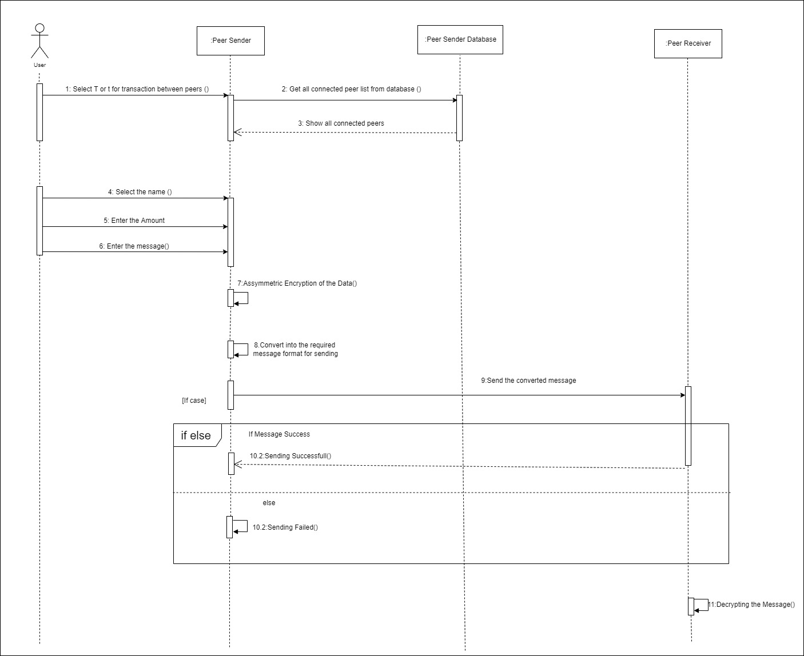
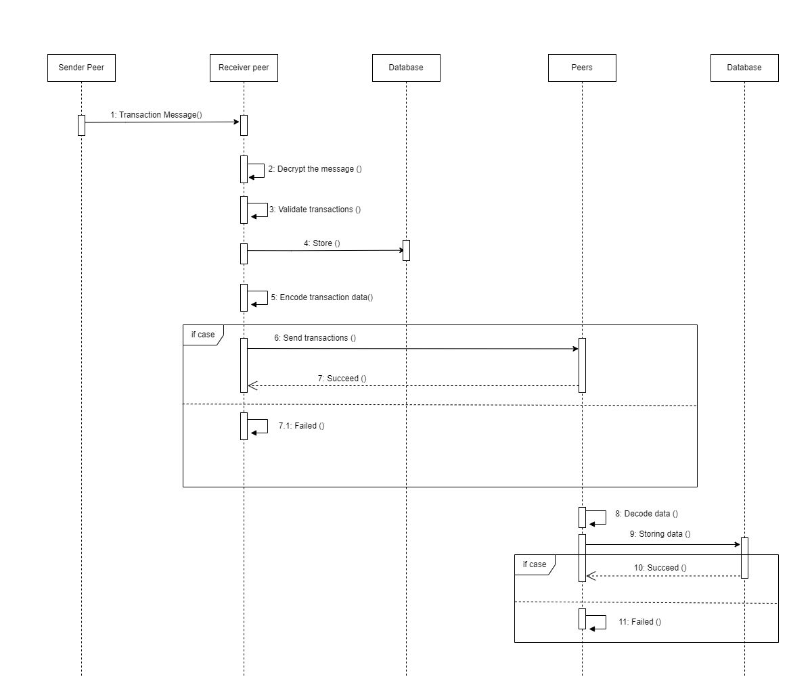
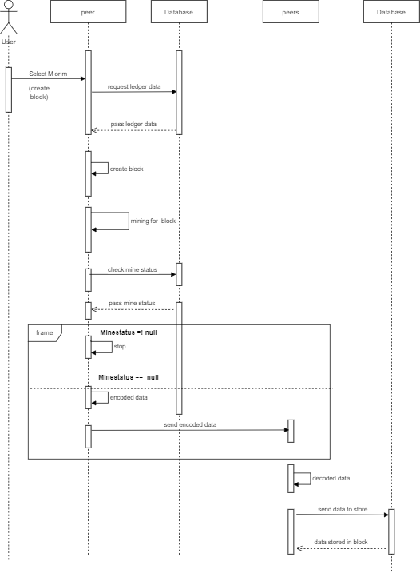

# CheeseCoin (BlockChain) Protocol

## PEERS
Every peer is identified by:
- **Unique Name**.
  - A String  (no encryption), also a 
  - A public key (if encryption added).
- **IP address and Port Number**.

Every peers in the network are equal. A peer acts both as a TCP server - as it accepts other peers' connections - and as a client since it connects to the tracker for peer discovery and to other peers for broadcasting the data.

Peers can:
- **Interact with other peers**.
  - By broadcasting new cheeses(Blocks).
  - To perform transactions between peers.
  - To ask for an updated version of the cheese chain (BlockChain).
- **Communicate with the tracker**.
  - When a new peer joins the network, it has to first notify the tracker of its existence for the tracker to record his information (Name, IP address, port) and allow it to give it to other peers afterward.
  - When the peer sent the information send to the tracker then tracker receives the data and send to all connected peers,At this If sending failed, then data with respect to the connection details of failed peers to the message queue system,constantly check that the failed peer is come online, when it come online the new peer details send to that peer
  - A peer shall respond to keep-alive messages sent periodically (every 30 or 60 seconds) by the tracker for being able to maintain up-to-date information about the online peers.
- **Mine**.
  - This would be the main task of the peers.
  - The goal of a peer is to find the new valid cheese (Valid Block).
    * A cheese(Block) is valid when its smell(hash) starts by D(Here the difficulty number is 4) number of zeros. 
    * D is called the difficulty and it is **fixed**.
  - The first transaction of every cheese is an special transaction, and there is a reward for mining it. The amount of this reward will be fixed. To make sure that the amount of this reward has not changed, other peers will verify it when verifying the whole block.
  - When a peer finds a new valid cheese, it will broadcast it to all other peers.
  - First cheese(Block) of a cheese chain (Block Chain) is called Raclette Cheese(also Called Genesis Block)

The different tasks a peer can do (explained above) shall be contained within different threads and should be run concurrently, and to handle mutual exclusion blocking queues (or a similar tool) will be used.

## TRACKER
There is only one tracker in the whole network and it will be a TCP Server that will work as a Peer-Index Network Database. The tracker might not record any information regarding the cheesechain nor take part in the mining process.
Tracker only contain the information such as (Name,IP Address,Port Number) of every peer connected to the network
Its task is simply to maintain updated information of the online peers and help peers discover each other in the network by resolving their requests.

## CHEESE(Block)
The basic unit of information, encoded as a JSON String.

## Protocol Specification ##

## Message types  in the system ##

1. Request 
2. Response

## Request -  

## Message format  - [RequestMethod][MessageTypes][Data/Arguments]

# 1. Request Method  - Two type request methods are here 

  |Request Keyword|Request Method|Description|
  |---------------|--------------|------------|
  |G|Get|To receive data from the nodes|
  |P|Post|To Send data to the nodes|

    * here mostly "Post request" are used and rarely the get request is been used

# 2. MessageTypes  - Here Mainly 10 message types are defined which will be discussed more in details in the coming explanation  - Here first letter of each message type is used in the Full Message Format.

| Message Type | Message Name |Request Type | Description | Payload Type |
| ------------- | ------------- |------------- |------------- | ------------- |
J | Join | Post |Broadcast the new node details to the tracker from the new node and then tracker to other connected peers| JSON String representation which is encode to bytes | 
K | KeepAlive | Post |The tracker will send periodically this messages to the peers to check their status | Random nonce received as response |
U | UnconnectedPeerList |Post | Send the unconnected peers list found during the "KeepAlive" test  and broadcast this data to all other connected peers to remove that details from their database| JSON String representation which is encode to bytes  |
T | Transaction | Post |A peer will broadcast this message when performing a transaction for the other peers to validate it and include it into the cheesechain(BlockChain) | JSON String representation which is encode to bytes|
L | TransactionLedger | Post | Full transaction message to adding it in the transaction ledger | JSON String representation which is encode to bytes |
M | MineComplete |Post |Send the Mining complete status to the other peers | JSON String representation which is encode to bytes  |
N | NewBlock | Post|A peer will broadcast this message when discovering a new valid cheese | JSON String representation which is encode to bytes|
P | Ping | Post |Sent from one peer to another Peer to make sure that it is online before trying to establish a TCP connection | Random nonce |
H | History | Get|Get the history of blocks in the individual nodes.This should be useful when new node is connected to the network | JSON String representation which is encode to bytes |
S | SendConnected | Post| Found the connected peer Automatically using the "KeepAlive" test and found any registered peers(after the unconnected state of that peer). Send this information to all peers | JSON String representation which is encode to bytes |
R | RequestConnected | Get| Request the list of connected peers from the tracker by a newly connected peer | JSON String representation which is encode to bytes |
* payload information and  explanation of  all types of  request and corresponding response will discuss in details in the coming section.

# 3. [Data/Arguments] - The data/argument is the content which need to be send or receive by the nodes.Here the message is of simple json format.Here Data or argument which deppends on the type of request method([get or post]).
Here moslty the types of all data is JSON String 

## Repsonse -

## Response message format  - [StatusCode][Data]

1. Status - Here the status received for every successful send the message is "SUCCEED" - for every post request.

2. Data  - Here data is same as the request type and is of json String format.This optional in every messages

## Explanations and Examples of all types requests and corresponding responses in the cheese coin system(block-chain).Also, Here explain the sequence of operation with the sequence diagram  for the easiser assessment of  this system- 

# 1. [P][J][Data] -  Join 
Here when a node wants to added to the existing network ,then the new node will send it ip address and port number to the tracker server.Tracker will add the node details to the network list(Store it in database) and broadcast this new information to all other connected peer
# Sample Message format for this request  - 
- b'[P][J][{"name": "Arun", "port": "4001", "ipaddress": "192.168.0.13", "publickey": "PublicKey(6889655427552200076354428835056690601368344442973712579820372495436699722997255720370353402608729051843347233977967904133958397278532695372033434031389231, 65537)"}]
### Response for this request  -  
- Succeed - Here the sender get the "Succeed" message depends on the situations.If the message is successfully received he gets to "succeed" reply from the receivers
- Here when the new peer wants to connect  to the network, Select "C" or "c"(new node terminal output window) then the details of the new node will send to the tracker which contain the 
IP Address,Port Number and Public Key.Tracker will receive  this information and broadcast the details all connected peer in the network and also add the network to the tracker's local database
Also,All peer connected to the network get the same message via tracker.Each peer will receive this data, extract it and store it in the database
# 2. [P][T][Data] - Transaction
Message format for sending the transaction amount and message between one peer to another peer.
###[sample message format]  - 
-  b'[P][T][{"TransactionID": "2b209aa242755815b187bd049d9d9be18cb598e4", "Sendername": "Arun", "Receivers": "Arun", "Dateandtime": "2022-03-12 20:19:11.254937", 
"Data": {"Message": "b'r\\x13\\xc1^\\xf9\\r\\x83Qj\\\\\\xbb9\\x01\\xe3\\x00+\\xcdC\\xbf\\xc1+\\xba\\x1e\\x1e\\xaa\\x17j\\xa5@\\x8f\\xf7_\\x05xKrlf\\xac\\x02\\xbf\\xb4~\\xd2\\x8e\\x1d\\x8e*r\\x16[\\x8f\\xef\\xd4\\xe8\\xa8sz\\x1b\\x93\\xa9\\x8b\\xc2L'", 
"DigitalSignature": "b'M\\xa0*Q\\xc4\\t\\xd8\\xbe0\\xa3|=R\\x8c\\xbd\\xcc<\\xb4\\x0c\\xcdHL\\xb3sv\\x9e\\xf0<\\xa8\\xc9\\x9c\\xffq$x\\x02\\xe9\\x07\\xfc\"\\xa4-\\xb7\\xb0\\x00\\x95)\\xb2\\x8c\\xb9\\xcag\\xfa\\xba\\xeb}h\\xa8\\xffR/\\x14\\xd9\\xb6'"}}]

Here the user will select the peer name (receiver) from the given list and enter the amount and meesage.After that the  peer(sender) will encrypt the amount and meesage
and send to the peers with the selected name(receiver peer).(with respect to the name peer will get the details like IP Address,PortNumber and Public Key the reciever peer from the database)
### Response for this request  - 
- Succeed -  
* Here the sender get the "Succeed" message depends on the situations.If the message is succesfully received he gets to "succeed" reply from the receivers

### Sequence Diagram of the above request and corresponding process in the peer(Between the sender and the receiver)

# 3. [P][L][Data] - Ledger
Message format for broadcasting the validated transaction details done between two peers to all other peer in the network.Each peer will receive this information and store it in their local ledger
###[sample message format]  - 
-  b'[P][T][{"TransactionID": "2b209aa242755815b187bd049d9d9be18cb598e4", "Sendername": "Arun", "Receivers": "Arun", "Dateandtime": "2022-03-12 20:19:11.254937", 
"Data": {"Message": "b'r\\x13\\xc1^\\xf9\\r\\x83Qj\\\\\\xbb9\\x01\\xe3\\x00+\\xcdC\\xbf\\xc1+\\xba\\x1e\\x1e\\xaa\\x17j\\xa5@\\x8f\\xf7_\\x05xKrlf\\xac\\x02\\xbf\\xb4~\\xd2\\x8e\\x1d\\x8e*r\\x16[\\x8f\\xef\\xd4\\xe8\\xa8sz\\x1b\\x93\\xa9\\x8b\\xc2L'", 
"DigitalSignature": "b'M\\xa0*Q\\xc4\\t\\xd8\\xbe0\\xa3|=R\\x8c\\xbd\\xcc<\\xb4\\x0c\\xcdHL\\xb3sv\\x9e\\xf0<\\xa8\\xc9\\x9c\\xffq$x\\x02\\xe9\\x07\\xfc\"\\xa4-\\xb7\\xb0\\x00\\x95)\\xb2\\x8c\\xb9\\xcag\\xfa\\xba\\xeb}h\\xa8\\xffR/\\x14\\xd9\\xb6'"}}]
### Response for this request  -  
- Succeed - Here the sender get the "Succeed" message depends on the situations.If the message is successfully received he gets to "succeed" reply from the receivers

# 4. [P][M]Message - Mine Complete
This request is to send the mine complete status to all others peers.This request is for the Proof of Work Concept in the Cheese Coin System(BlockChain System).
##[Sample message format] - 
- b'[P][M]MineCompleted
- All other peers receive this message store and stop the mining process 
### Response for this request  -  
- Succeed - Here the sender get the "Succeed" message depends on the situations.If the message is successfully received he gets to "succeed" reply from the receivers

# 5. [P][N][Message] - NewBlock
When the mining is complete and then check for the "MiningCompleted" status in the database . if the "MiningComplete" status is not received then the mined block is broadcast to all other peers
##[Sample message format]
- b'[P][N][{"index": "2", "hash": "000008323c645bf9a7dffe8109499ac4dbdb72ded3686ae7d4276c1636394471", "Block": {"Header": {"Version": "V1", "PreviousHash": "00006a374bcc1407441cf3bdd36efc062a81ea247dded90ae6d08b54c5950122", "MerkleRoot": ["d20bea979f0db2fe91a5ce9db4d6d40c271e47c5"], "Timestamp": "2022-03-13 23:47:57.282772", "DifficultyTarget": "4", "Nonce": 82201}, "TransactionCounter": 2, "TransactionList": {"Transactions": [{"index": 1, "DataAndTime": "2022-03-13 23:47:53.378114", "TransactionID": "ce48ee6b01ef1767ccffb75d42ee2de7af21efdb", "SenderName": "Arun", "ReceiverName": "Arun", "Data(Amount and Message)": "b\\"\\\\x17L\\\\xc9\\\\xc4\\\\xe68\\\\xb6\\\\xadp[@\\\\xda\\\\xa9\\\\x11\\\\x1bR\\\\xbd\\\\xc0i\\\\x83?)\\\\xd0\\\\t=e\\\\x03\\\\xa1&_\\\\xa1\\\\xf5\\\\x03\\\\xa6n\\\\x95\\\\xbes\\\\xd3\\\\x1f\\\\xf4\\\\xfc*F\\\\xe4\\\\xd3\\\\x8d\\\\xa6\\\\xf6V\\\\xf4|HP$\\\\xfb\\\\xef\\\\x8d\\\\xccd\\\\xe7\'\\\\x10\\\\x13\\"", "DigitalSignature": "b\'=\\\\xccF#5\\\\x8a\\\\xc0VF\\\\x8d\\\\x8a\\\\xf2\\\\x90\\\\xcd\\\\x8d\\\\x96\\\\x07Y\\\\x19\\\\x0b\\\\x94\\\\x99\\\\x94\\\\x1d\\\\xe3\\\\x85L\\\\x98\\\\x00Vh3$\\\\xff-{\\\\xaa\\\\xd8\\\\x93\\\\xfd\\\\x15\\\\xe9\\\\xd0\\\\xd1JX\\\\t\\\\x1d\\\\xba!r\\\\xcf?\\\\xcb\\\\x9a\\\\x98&.\\\\x82?\\\\x9eP\\\\x9a\\\\xaa\'"}, {"index": 1, "DataAndTime": "2022-03-13 23:47:53.378114", "TransactionID": "ce48ee6b01ef1767ccffb75d42ee2de7af21efdb", "SenderName": "Arun", "ReceiverName": "Arun", "Data(Amount and Message)": "b\\"\\\\x17L\\\\xc9\\\\xc4\\\\xe68\\\\xb6\\\\xadp[@\\\\xda\\\\xa9\\\\x11\\\\x1bR\\\\xbd\\\\xc0i\\\\x83?)\\\\xd0\\\\t=e\\\\x03\\\\xa1&_\\\\xa1\\\\xf5\\\\x03\\\\xa6n\\\\x95\\\\xbes\\\\xd3\\\\x1f\\\\xf4\\\\xfc*F\\\\xe4\\\\xd3\\\\x8d\\\\xa6\\\\xf6V\\\\xf4|HP$\\\\xfb\\\\xef\\\\x8d\\\\xccd\\\\xe7\'\\\\x10\\\\x13\\"", "DigitalSignature": "b\'=\\\\xccF#5\\\\x8a\\\\xc0VF\\\\x8d\\\\x8a\\\\xf2\\\\x90\\\\xcd\\\\x8d\\\\x96\\\\x07Y\\\\x19\\\\x0b\\\\x94\\\\x99\\\\x94\\\\x1d\\\\xe3\\\\x85L\\\\x98\\\\x00Vh3$\\\\xff-{\\\\xaa\\\\xd8\\\\x93\\\\xfd\\\\x15\\\\xe9\\\\xd0\\\\xd1JX\\\\t\\\\x1d\\\\xba!r\\\\xcf?\\\\xcb\\\\x9a\\\\x98&.\\\\x82?\\\\x9eP\\\\x9a\\\\xaa\'"}]}}}]'
### Response for this request  - 
- Succeed - Here the sender get the "Succeed" message depends on the situations.If the message is successfully received he gets to "succeed" reply from the receivers

# 6.[G][K][Message] - KeepAlive
Here the KeepAlive is  used to check the communication status of the connected nodes in the network which done by the tracker.
## [ Sample request format]
- b'[G][K]000000
# Response of this request - 
When the peers get this message then they will return the response as per the design
- b'[G][K]111111
- KeepAlive request is to check the communication status of the connected nodes in the network.The Tracker will periodically(for each 30 seconds) send the request to the peers and the peers will reply back
if the Tracker doesn't get any reply from any peer which is in the database of the Tracker, and it will be removed the tracker's database also send the unconnected peer list to the all other connected peers ,also then the peers will remove the same from their database too

# 7.[P][U][Message]  -  Unconnected Peers List
- Tracker will found the unconnected peers during liveliness test and Tracker will send these peers list  to all connected peer and connected peers receives this message and delete the peer from the database 
- RequestMessageFormat  - [P][U][data]
- Response - Succeed

# 8.[G][H][Message]  -  BlockChain(CheeseCoin)  - History
- The newly connected peers can request the copy of the blockchain existing in the system.Peer receives this blockchain copy to save in the local database of that particular peer 
- Request  - [G][H](Connectiondetails) - IPaddress and the port
- Response - [G][X]Blockchain history Data

# 9.[P][P][Message]  - Ping between the peers - For every 1 minute peer will send random messages to all connected peers in the network and check for the response 
- Request - [P][P]0000000
- Response - Succeed
# 10.[P][S][Message] - Send Connected
- The tracker will do liveliness test to all the registered peers.So to due to some reason if one peer will disconnected and again connected.This peer details will automatically detect from liveliness test and send this peer details to other connected peer to update the local database at the peer side 
- Request - [G][H][Newly connected peer data]
- Response - Succeed
# 11.[G][R][Message] - Request for the list of connected peer from the tracker by a individual peer
Each peer can request a total list of connected peers from the tracker by this request
- Request - [G][R][ConnectedPeers]
- Response  -[G][R][tuple contain the all connected peers in the network]
